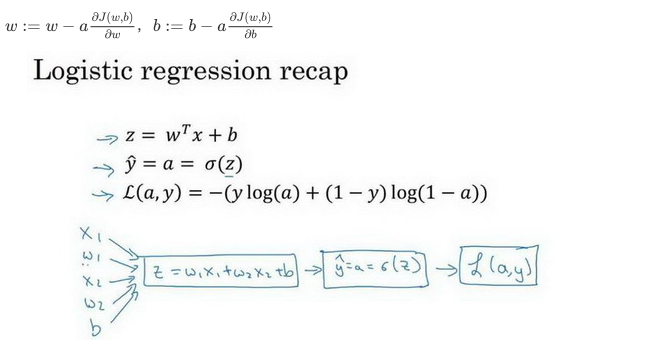

#深度学习-吴恩达-第二周  
##2.1 二分类（Binary classification）
神经网络的计算步骤：1、forward spause or forward propagation  2、backward pause or backward propagation

符号定义 :  
$x$:表示一个$n_x$维数据，输入数据，纬度$(n_x,1)$ ，列向量。   
$y$:表示输出结果，取值$(0,1)$  
$(x^{(i)},y^{(i)})$:表示第i组数据，此处默认为训练数据。  
$X=[x^{(1)}，...,x^{(m)}]$:表示所有的训练数据集的输入,m表示样本数目；纬度$(n_x,m)$， 纵向堆积。   
$Y=[y^{(1)}，...,y^{(m)}]$：表示所有训练集的输出。纬度$(1,m)$,纵向堆积。     

##2.2逻辑回归
$\hat{y} = w^T + b$

要将上式输出变成概率在0～1之间变化，同时随着x的输出y进行非线形变换，因此需要应用sigmoid函数。  
$$\hat y = \sigma (w^T +b) $$
$$\sigma (z) = \frac{1}{1+e^{-z}}$$
实现逻辑回归就是让机器通过训练集去学习参数$w,b$使得$\hat y$对$y$来说是一个好的估计。
##2.3逻辑回归的代价函数
为了训练逻辑回归模型的参数w和b，我们需要一个代价函数来反复调整w和b,
损失函数或误差函数（单样本）：  
$ loss	Function: L（\widehat y , y)$  
$$L(\widehat y , y)= -ylog(\widehat{y})-(1-y)log(1- \widehat{y} )$$
$y=1,L=-log(\widehat{y} )。y=0,L=-log(1-\widehat{y} )$

算法的代价函数是对m个样本的损失函数求和后除以m:
$$J(w,b)=\frac{1}{m} \sum_{i=1}^{m}L ( \widehat{y}^{(i)},y^{(i)}) = \frac{1}{m} \sum_{i=1}^{m} (-y^{(i)}log(\widehat{y}^{(i)})-(1-y^{(i)})log(1- \widehat{y}^{(i)} ))$$

##2.4梯度下降
迭代更新(偏导数）：
凸函数，有极值。迭代更新参数
$$w=w- \alpha \frac{\partial J(w,b)}{\partial w}$$
$$b=b- \alpha \frac{\partial J(w,b)}{\partial b}$$

##2.9逻辑回归中的梯度下降


logistic regression recap:  
向前传播的重要公式 （单个样本) 
$$z=w_1x+w_2x+b$$
$$\sigma {(z)}= \frac {1}{1+e^{-z}}$$
$$\widehat {y} = a =\sigma (z)$$
$$L(a,y)=-(ylog(a)+(1-y)log(1-a))$$


反向传播的重要公式(递归更新参数）（单个样本)   
注意：向前传播都做完后才能    
符号应用习惯:我们用$da$表示$\frac{dL(a,y)}{da}$，$dz$表示$\frac{dL(a,y)}{dz}=\frac{dL}{dz}=\frac{dL}{da}*\frac{da}{dz}$

$$\frac {dL(a,y)}{da}=da=-\frac {y}{a}+\frac{1-y}{1-a}$$
$$\frac {da}{dz}=a(1-a)$$
$$\frac {dL(a,y)}{dz}=dz=a-y$$
$$dw_1=\frac{dL}{dz}*\frac{dz}{dw_1}=x_1dz$$
$$dw_2=\frac{dL}{dz}*\frac{dz}{dw_2}=x_2dz$$
$$db=dz$$
$$w_1=w_1-adw_1$$
$$w_2=w_2-adw_2$$
$$b=b-adb$$
##2.10 m个样本的梯度下降
损失函数定义：  
$$J(w,b)=\frac{1}{m} \sum_{i=1}^{m}L (a^{(i)},y^{(i)}) = \frac{1}{m} \sum_{i=1}^{m} (-y^{(i)}log(a^{(i)})-(1-y^{(i)})log(1- a^{(i)} ))$$

假设参数只有w1、w2、b  
for i=1 to m:

>>$$z^{(i)}=w^Tx^{(i)}+b$$
$$a^{(i)}=\sigma(z^{(i)})$$
$$J +=-[y^{(i)}log(a^{(i)})+(1-y^{(i)})log(1- a^{(i)} )]$$
$$dz^{(i)}=a^{(i)}-y^{(i)}$$
$$dw_1 += x_1^{(i)}dz^{(i)}$$
$$dw_2 += x_2^{(i)}dz^{(i)}$$
$$db+-=dz^{(i)}$$

>$J = \frac{J}{m}$  
$dw_1=\frac{dw_1}{m}$    
$dw_2=\frac{dw_2}{m}$   
$w_1=w_1-\alpha *dw_1$  
$w_2=w_2-\alpha *dw_2$   
$b=b-\alpha *db$ 

**注意**：以上的for循环只做了一次梯度下降。要进行多次训练集循环来逐步更新参数。此方法只有两个特征，若有n个特征，则需要写两个for循环，内层循环循环样本，外层循环循环特征。

``` 
伪代码：    
	for 迭代次数  
		for 循环特征数  
			for 循环样本更新每个特征参数 
``` 

##2.13 向量化逻辑回归
$X=[x^{(1)}，...,x^{(m)}]$:表示所有的训练数据集的输入,m表示样本数目；纬度$(n_x,m)$， 纵向堆积。  
W是$(n_x,1)$的向量。  
$Z=[z^{(1)},z^{(2)},...,z^{(m)}],$纬度$(1,m)$   
$Z=W^TX+[b,b,...,b]$

编程代码：  
```
Z = np.dot(w.T,X) + b  
```


 
