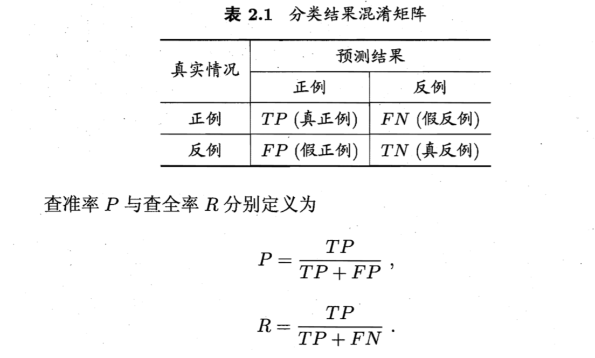

# 李航《统计学习方法》导读
##一、统计学习方法概述
1.1 统计学习  
1.2 监督学习  
1.3 统计学习三要素  
1.4 模型评估与模型选择  
1.5 正则化与交叉验证  
1.6 泛化能力  
1.7 生成模型与判别模型  
1.8 分类问题  
1.9 标注问题  
2.0 回归问题 
 

###1.1 统计学习
统计学习的方法是基于数据构建统计模型从而对数据进行预测与分析。统计学习由四部分组成：  
监督学习（supervised learning）
eg:    
非监督学习（unsupervised learning） 
eg:   
半监督学习（semi-supervised learning） 
eg:   
强化学习（reinforcement learning) 
eg:  

统计学习方法包括模型的假设空间、模型选择的准则和模型学习的算法，称其为统计学习方法的三要素，简称：模型（model）、策略（strategy）和算法（algorithm）

```
实现统计学习的方法步骤如下：  
（1）得到一个有限的训练数据集合  
（2）确定包含所有可能的模型的假设空间，即学习模型的集合  
（3）确定模型选择的准则，即学习策略  
（4）实现求解最优模型的算法，即学习的算法  
（5）通过学习方法选择最优模型  
（6）利用学习的最优模型对新数据进行预测和分析 
```

###1.2 监督学习

在欧氏空间中，每个具体的输入是一个实例（instance），通常由特征向量（feature space）表示。**所有特征向量存在的空间**成为特征空间（feature space）。输入变量：X，取值x，输出变量：Y，取值y。

输入实例x（每个样例）的特征向量记作：


>$$x=\frac{-b\pm\sqrt{b^2-4ac}}{2a}$$
>$$x=(x^{(1)},x^{(2)},...,x^{(n)})^{T}$$ 
>$x^{(1)}$表示x的第i个特征 ，$x_{i}$表示多个输入变量中的第$i$个,即
>$$x_{i}=(x_{i}^{(1)},x_{i}^{(2)},...,x_{i}^{(n)})^{T}$$

训练数据集：  

>$$T=\{(x_{1},y_{1}),(x_{2},y_{2}),...,(x_{N},y_{N})\}$$

输入变量与输出变量均为连续变量的预测问题成为**回归问题**，输出变量为有限个离散变量的预测问题称为分类问题。


统计学习假设数据存在一定的统计规律，$X$和$Y$具有联合概率分布的
假设就是监督学习关于数据的基本假设

>监督模型的学习目的就是找到最好的模型，由输入空间映射到输出空间，由条件概率$P(Y|X)$表示，决策函数为$Y=f(X)$.  
>通过学习得到一个模型，表示为条件概率分布$\hat{P}(Y|X)$ ，可以理解为给定一组数据$X$,则判断为类别$Y$的条件概率。  
>决策函数为$\hat{Y}=f(X)$
 
###1.3 统计学习三要素
	方法 = 模型 + 策略 + 算法
####1.3.1模型：  
在监督学习过程中，模型就是所要学习的条件概率分布或决策函数，统计学习的首要考虑的问题是学习什么样的模型。
  
####1.3.2.策略
>损失函数：度量模型一次预测的好坏
>风险函数：度量平均意义下模型预测的好坏

**1、损失函数和风险函数**  
在假设空间$\Gamma $中选取模型$f$,作为决策函数，对于给定的输入$X$,由$f(X)$给出相应的输出$Y$,则$f(X)$与$Y$可能一致也可能不一致，用一个损失函数（loss function ）或代价函数（cost function）来度量预测值（非负），记作$L(Y,f(x))$。
常用的损失函数为：  
（1）0-1损失函数（0-1 loss function）
$$L(Y,f(X))=\left\{{\matrix{
{1,\ \ Y\ne f(X)}\cr
{0,\ \ Y=f(X)}\cr
}}\right.$$

（2）平方损失函数（quadratic loss function）
$$L(Y,f(X))=(Y-f(X))^{2}$$
  
（3）绝对损失函数（absolute loss function） 
$$L(Y,f(X))=|Y-f(X)|$$ 
（4）对数损失函数（logarithmic loss function)  
$$L(Y,f(X))=-\log P(Y|X)$$
**损失函数的值越小，模型越好**
>损失函数的期望是(风险函数risk function 或 期望损失 expected loss）：  
>$$R_{\exp }(f)=E_{p}[L(Y,f(X))]=\int_{X\times Y}{L(Y,f(X))P(x,y)dxdy}$$

由与联合分布$P(X,Y)$是未知的，所以上式并不能直接计算，但又要通过未知分布期望风险，因此监督学习是一个病态问题（ill-formed problem）

给定一个训练数据集
$$T=\{(x_{1},y_{1}),(x_{2},y_{2}),...,(x_{N},y_{N})\}$$
模型$f(X)$关于训练数据集的平均损失称为经验风险（empirical risk）或经验损失（empirical loss）记作：  
$$R_{emp}(f)={{1}\over{N}}\sum\limits_{i=1}^{N}{L(y_{i},f(x_{i}))}$$


<mark>-期望风险$R_{exp}(f)$是模型关于**联合分布**的期望损失。</mark>  
<mark>-经验风险$R_{emp}(f)$是模型关于**训练样本集**的平均损失。</mark>   
<mark>-根据大数定律下，两者理论上相等，但现实中往往需要对经验风险进行一定的修正。</mark>  
 
**修正的两个基本策略：经验风险最小化与结构风险最小化,两者的区别在于后者对了一个正则化项**    
2、经验风险最小化与结构风险最小化
经验风险最小化（empirical risk minimization ，ERM）的策略认为经验风险最小的模型就是最优模型。即求解最优化问题（现实广泛使用）
$$\underset{f\in F}{min}{{1}\over{N}}\sum\limits_{i=1}^{N}{L(y_{i},f(x_{i}))}$$
>极大似然估计（maximum likelihood estimation）就是经验风险最小化的一个例子。当模型时条件概率分布，损失函数是对数损失函数时，经验风险最小化等价于极大似然估计。  
当样本容量小会导致过拟合（over-fitting）

>结构风险最小化（structural risk minimization，SRM）是为了防止过拟合而提出来的策略。结构风险最小化等价于**正则化（regularization）**。其在经验风险上加上表示模型复杂度的正砸化项（regularizer)或罚项（penalty term）
>定义是

$$R_{srm}(f)={{1}\over{N}}\sum\limits_{i=1}^{N}{L(y_{i},f(x_{i}))}+\lambda J(f)$$
>其中$J(f)$为模型复杂度，假设空间$F$的泛函（？）$\lambda\geqslant 0$

>例如贝叶斯估计中的最大后验概率估计（maximum posterior probability estimation MAP)就是结构风向最小化的一个例子。  
模型：条件概率分布  
损失函数：对数损失函数  
模型复杂度：先验概率表示  
结构风险最小化等价于最大后验概率估计。  
求解最优化问题

$$\underset{f\in F}{min}{{1}\over{N}}\sum\limits_{i=1}^{N}{L(y_{i},f(x_{i}))}+\lambda J(f)$$  
这样监督学习的问题就变成了经验风险或结构风险函数的最优化问题。这时经验或结构风险函数是最优化的目标函数。

	分类模型，是建立的问题模型，用来做数据的分类。
	经验风险最小化策略和结构风险最小化策略，是用来每次迭代确定模型参数的方法。

####1.3.3算法  
算法是指学习模型的具体计算方法，通常求解最优化问题的全局最优解。  

###1.4 模型评价于模型选择

####1.4.1 训练误差于测试误差  
损失函数给定时，基于损失函数的模型的训练误差（training error）和模型的测试误差（test error）就自然成为学习方法评估的标准。  
**注意**：统计学习方法具体采用的损失函数未必是评估时使用的损失函数。当然让两者一致时比较理想的。 P10
####1.4.2 过拟合与模型选择  
	过拟合一般存在于模型的复杂度过高，导致学习好预测差。
	模型的选择要考虑：是否会过拟合、模型的复杂度、参数个数。  
	
例如在多项式函数拟合中可以看到，随着多项式次数（模型复杂度）增加，训练误差会减少，但测试误差却在增加。

###1.5 正则化与交叉验证（模型的选择方法）
####1.5.1 正则化

正则化就是结构风险最小化策略的实现：正则化项一般时模型复杂度的单调递增函数，模型越复杂，正则化值就越大，例如正则化项可以时模型参数向量的范数。
正则化项一般形式：  
$$\underset{f\in F}{min}{{1}\over{N}}\sum\limits_{i=1}^{N}{L(y_{i},f(x_{i}))}+\lambda J(f)$$
第一项是经验风险，第二项是正则化项，两者可以取不同的形式，例如，经验风险是平方损失，二正则化项是$L_2$,$L_1$范数， $\lambda$是两者关系系数。
如：
$$L(w)={{1}\over{N}}\sum\limits_{i=1}^{N}{(f(x_{i};w)-y_{i})^{2}}-{{\lambda}\over{2}}\left \| w \right \|^2$$
$$L(w)={{1}\over{N}}\sum\limits_{i=1}^{N}{(f(x_{i};w)-y_{i})^{2}}-\lambda \left \| w \right \|$$

####1.5.2 交叉验证  
另一种常用的模型选择方法是交叉验证（cross validation）,思想是重复的使用数据，把给定的数据进行切分，将切分的数据集组合成训练机测试集，在此基础上反复的进行训练测试以及模型选择。

1、简单交叉验证  
（数据切分成两部分：70%数据验证集，30%测试集）
2、S折交叉验证  
切分成S个互不相交的大小相同的子集，然后利用S-1个子集的数据训练模型，利用余下的子集测试模型；将这一过程对可能的S种选择重复进行，最后选出S次评测中平均测试误差最小的模型。

3、留一交叉验证
S折的特殊情况：$S=N$,$N$是给定数据集的容量

###1.6 泛化能力  
泛化误差模型(理论分析，学习模型的期望风险)：
$$R_{\exp }(\hat{f})=E_{p}[L(Y,\hat f(X))]=\int_{X\times Y}{L(y,\hat f(x))P(x,y)dxdy}$$

**期望风险、经验风险、泛化能力的关系**  
$$R_{\exp }(f)=E_{p}[L(Y,f(X))]$$

$$R_{emp}(f)={{1}\over{N}}\sum\limits_{i=1}^{N}{L(y_{i},f(x_{i}))}$$

$f_n$的泛化能力
$$R_{\exp }(f_n)=E_{p}[L(Y,f_n(X))]$$

**定理**：泛化误差上界，对于二分类问题，当假设空间是有限个函数的集合$F=\{f_{1},f_{2},...,f_{d}\}$时，对任意一个函数$f\in F$ ,至少以概率$1 - \delta $,以下不等式成立： 
 
$$R(f)\leqq \hat R(f)+\varepsilon (d,N,\delta )$$
左边是泛化误差，右边是泛化误差上界（其中第一项是训练误差，第二项是N的单调递减函数）

其中
$$\varepsilon (d,N,\delta )=\sqrt{{{1}\over{2N}}(\log d+\log{{1}\over{\delta}})}$$

###1.7生成模型与判别模型  
监督学习的任务就是学习一个模型，决策函数为
$$Y=f(X)$$
或者条件概率分布  
$$P(Y|X)$$
生成模型：朴素贝叶斯法和隐马尔可夫模型。通过学习$P(x,y)$的联合分布，然后求出条件概率分布$P(Y|X)$ 的模型。优点：还原出联合分布$P(X,Y)$,学习收敛速度快，样本增加，可以更快收敛到真实模型，存在隐变量，只可以用生成模型。

$$P(Y|X)={{P(X,Y)}\over{P(X)}}$$
判别模型:由数据直接学习决策函数$f(X)$,或者条件概率$P(Y|X)$。典型判别模型：kNN,感知机，决策树，罗辑思迪回归模型，最大熵模型，支持向量机，提升方法，条件随机场。 
判别方法优点：准确率高，简化学习。

###1.8 分类问题
评价分类器（二分类）性能的指标一般是准确率（accuracy）：正确分类样本数与总样本数之比。  
精确率（precision）、召回率



F1值
$$F1={{2\times P\times R}\over{P+R}}={{2TP}\over{2TP+FP+FN}}$$

###1.9标注问题

标注常用的统计方法有：隐马尔可夫模型，条件随机场

###2.0 回归问题

回归学习最常用的损失函数是平房损失函数，回归问题可以由著名的最小二乘法求解。

##总结  
对于给定数据集的统计学习模型求解的步骤  
（1）建立可能的分类或回归模型$f(X,Y)$  
（2）对于给定的模型建立损失函数$L(Y,f(X,Y))$
（3）求解最优化问题$minL(Y,f(X,Y))$的解。  
（4）对模型$f(X,Y)$中的参数建立启发式循环策略，例如随机梯度下降等，改变参数的值。  
（5）把最终参数带入模型$f(X,Y)$，应用于测试集，进行评估。  


  


