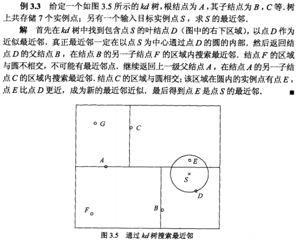

#第三章 k-NN
k近邻法实际上利用训练数据集对特征向量空间进行划分，并作为其分类的模型。  
k值的选择、距离度量、及分类决策规则是k近邻的三个基本要素。
##3.1 k近邻算法
基本思想：给定一个训练数据集，对新的输入实例，进行逐个距离计算，最后找到最近的k个实例，投票决定属于哪个分类。k近邻法没有显示的学习过程。
##3.1算法（k近邻）
输入：训练数据集$T=\{(x_{1},y_{1}),(x_{2},y_{2}),...,(x_{N},y_{N})\}$
其中$x_{i}\in X=R^{n}$,$y_{i}\in Y=\{c_1,c_2,...,c_k\},i=1,2,...,N,$为实例类别，$i=1,2,...,N$实力特征向量$x$;  
输出：实例$x$所属的类$y$  
（1）根据给定的距离度量，在训练集T中找到与x最近邻的k个点，涵盖这k个点的x的邻域记作$N_k(x)$:  
（2）在$N_k(x)$中根据分类决策规则（如多数表决）决定x的类别y:  
$$y=arg\ \underset {c_j}{max}\sum \limits_{{x_i} \in N_k(x)}{I(y_i=c_j)},i=1,2,...,N$$  
I为指示函数，当$y_i=c_i$时I为1，否则为0；  

##3.2 k近邻模型
###3.2.2 距离度量
距离一般用：欧式距离、$L_p$距离或Minkowski距离

###3.2.3 k值的选择
k较小，近似误差小，学习估计误差大，容易过拟合。
k较大，学习估计误差小，近似误差大，预测不准确。
一般情况则选择一个小的数值。
###3.2.4 分类决策规则
如果分类损失是0-1损失函数，分类函数为
$$f:R^n \rightarrow \{c_1,c_2,...,c_k\}$$
误分类的概率是
$$P(Y\neq f(X))=1-P(Y = f(X)) $$

给定$x \in X$,k个最近邻的实例点构成集合$N_k(x)$,涵盖类别$c_j$那么误分类率是
$${{1}\over{k}} \sum \limits_{x_i \in N_k(x)}I(y_j \neq c_j)=1-{{1}\over{k}} \sum \limits_{x_i \in N_k(x)}I(y_j = c_j)$$
可以看出使误差最小就要$\sum \limits_{x_i \in N_k(x)}I(y_j = c_j)$最大，所以多数表决规则等价于经验风险最小化。
##3.3 kd树
kd树减少计算距离的次数。  
kd树是一种对k维空间中的实例点进行存储以便对其进行快速检索的树形数据结构，kd树是二叉树，表示对k维空间的一个划分。构造kd树相当于不断的用垂直于坐标轴的超平面将k维空间划分。构成一系列的k维超矩型区域。
算法3.2（构造平衡KD树）

算法3.3（用KD树的最近邻搜索）
