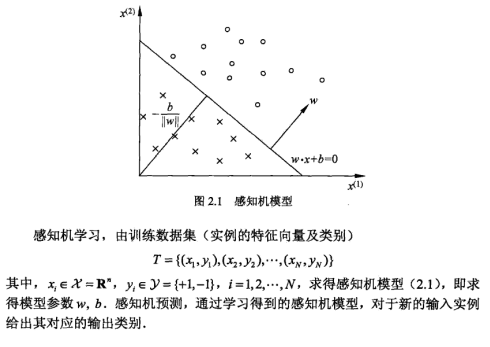

#第二章感知机
感知机对输入空间中将实例划分为正负两类的分离超平面，为此，导入基于误分类的损失函数，利用梯度下降法对损失函数进行极小化，求得感知机模型。

##2.1感知机模型  
假设输入空间是$X\subseteq R^{n}$,输出空间是$Y=\{+1,-1\}$.输入$x\in X$表示实例的特征向量，对应于输入空间的点；输出$y\in Y$表示实例的类别。函数如下：  
$$f(x)=sign(wx+b)$$
$w$和$b$是感知机模型参数，$w$是权重weight。$b$是偏置bias,$sing$是符号函数
$$sign(x)=\left\{{\matrix{
{+1,x\geqslant 0}\cr
{-1,x<0}\cr
}}\right.$$

几何解释：线性方程  
$$wx+b=0$$
对应于一个超平面。$w$是超平面的法向量，$b$是超平面的截距

###2.2 感知机学习策略  
####2.2.1 数据集的线性可分性  
**数据集的线性可分性**：给定一个数据集
$$T=\{(x_{1},y_{1}),(x_{2},y_{2}),...,(x_{N},y_{N})\}$$
其中$x_{i}\in X=R^{n}$,$y_{i}\in Y=\{+1,-1\},i=1,2,...,N,$如果存在某个超平面
$$wx+b=0$$
能够把数据集划分为正负样例，则数据集是线性可分的，否则是线性不可分的。
####2.2.2 感知机学习策略  
假设线性可分，即需要找到这样的一个超平面，确定感知机模型参数：$w$,$b$，需要确定一个学习策略，即求解经验损失函数的最小值问题。  
定义损失函数(点到超平面的距离）：
$${{1}\over{\|w\|}}|wx+b|$$
应用$L_2$范数  
误分类数据$(x_i,y_i)$有  
$$-y_i(wx_i+b)>0$$
则所有误分类点$M$总距离：  
$$-{{1}\over{\|w\|}}\sum \limits_{x_{i}\in M} y_i(wx_i+b)$$
综上：  
给定训练数据集
$$T=\{(x_{1},y_{1}),(x_{2},y_{2}),...,(x_{N},y_{N})\}$$
其中$x_{i}\in X=R^{n}$, $y_{i}\in Y=\{+1,-1\},i=1,2,...,N,$感知机$f(x)=sign(wx+b)$的损失函数定义为（参数学习策略-经验风险函数）：  
$$L(w,b)=-\sum \limits_{x_{i}\in M} y_i(wx_i+b)$$
其中$\|w\|=1$

###2.3 感知机学习算法  
感知机的问题，转化为求解损失函数的最优化问题，最优化的方法是随机梯度下降法。具体算法包括原始形式和对偶形式。
上述问题为损失函数极小化问题的解：
$$\underset {w,b}{min} L(w,b)=-\sum \limits_{x_{i}\in M} y_i(wx_i+b)$$
则：  
$$\triangledown_{w}L(w,b)=-\sum\limits_{x_{i}\in M}{y_{i}x_{i}}$$
$$\triangledown_{b}L(w,b)=-\sum\limits_{x_{i}\in M}{y_{i}}$$
随机选择**一个**误分类点$(x_i,y_i)$更新：
$$w=w-\eta ({{\partial L(w,b)}\over{\partial w}})=w+\eta y_{i}x_{i}$$
$$b=b-\eta ({{\partial L(w,b)}\over{\partial b}})=b+\eta y_{i}$$
$\eta$是步长、学习率（learning rate）

###算法2.1（感知机学习算法的原始形式）
输入：训练数据集$T=\{(x_{1},y_{1}),(x_{2},y_{2}),...,(x_{N},y_{N})\}$
其中$x_{i}\in X=R^{n}$,$y_{i}\in Y=\{+1,-1\},i=1,2,...,N,$,学习率$\eta，0<\eta\leqslant 1$,输出：$w,b$,感知机模型$f(x)=sign(wx+b)$  
（1）选取初值$w_0,b_0$  
（2）在训练集选取$(x_i,y_i)$  
（3）如果$y_i(wx_i+b)\leqslant0$  
$$w=w-\eta ({{\partial L(w,b)}\over{\partial w}})=w+\eta y_{i}x_{i}$$
注意：$y_ix_i$是一个向量。
$$b=b-\eta ({{\partial L(w,b)}\over{\partial b}})=b+\eta y_{i}$$
（4）转至（2）直到数据集没有误分类点。
####2.3.3 感知机学习算法的对偶形式
对偶形式的基本思想是：将$w,b$表示为实例$x_i,y_i$的线性组合的形式，通过求解其系数而求得$w,b$。对于误分类点$(x_i,y_i)$ ：
$$w=w-\eta ({{\partial L(w,b)}\over{\partial w}})=w+\eta y_{i}x_{i}$$
注意：$y_ix_i$是一个向量。
$$b=b-\eta ({{\partial L(w,b)}\over{\partial b}})=b+\eta y_{i}$$
逐步修改$w,b$，,经过多次迭代，增量分别是$a_iy_ix_i$,$a_iy_i$这里$a_i=n_i\eta$则，学习到最后
$$w=\sum\limits_{i=1}^{N}{a_{i}y_{i}x_{i}}$$
$$b=\sum\limits_{i=1}^{N}{a_{i}y_{i}}$$
$$a_i\geqslant 0$$
###算法2.2（感知机学习算法的对偶形式）
输入：训练数据集$T=\{(x_{1},y_{1}),(x_{2},y_{2}),...,(x_{N},y_{N})\}$
其中$x_{i}\in X=R^{n}$,$y_{i}\in Y=\{+1,-1\},i=1,2,...,N,$,学习率$\eta，0<\eta\leqslant 1$,输出：$w,b$,感知机模型$f(x)=sign(\sum\limits_{j=1}^{N}{a_{j}y_{j}x_{j}}*x+b)$  
其中 $a=(a_1,a_2,...,a_N)^T$  注意：a的维度是样本个数，$a_i$相当于第$i$个样本的权重（参见拉格朗日乘子法）。  
（1）$a \leftarrow 0,b \leftarrow 0$  
（2）在训练集选取$(x_i,y_i)$    
（3）如果$y_i（\sum\limits_{j=1}^{N}{a_{j}y_{j}x_{j}}*x_{i}+b)\leqslant 0$ 
$${a_{i}\leftarrow a_{i}+\eta}$$
$${b\leftarrow b+\eta y_{i}}$$
（4）转至（2）直到数据集没有误分类点。
对偶形式中训练实例仅以内积形式出现，因此用Gram矩阵先行计算。

	